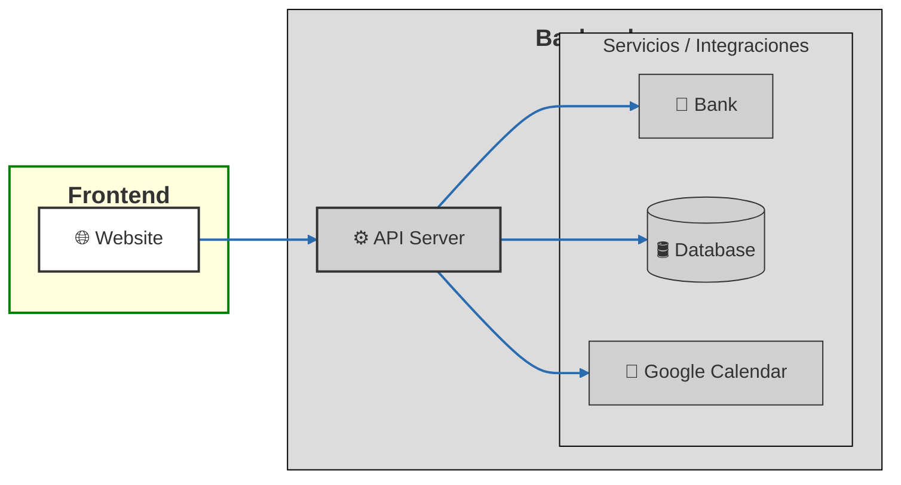

# <Project Name> — Frontend

Client for labor claim conciliators.

[Live Demo](<url>) · [Backend repo](https://github.com/leoariaspaz/rivendel) · [Case study](<url>)

![screenshot or GIF]

## Overview

This application is a client for labor claim conciliators, who manage
claims, the parties involved, and the sponsoring counsels representing
each party. Each claim involves two parties: the claimant and the
respondent, each of which may be represented by a sponsoring counsel.
The system also handles user credentials and can optionally synchronize
events with Google Calendar.

The visible functional domain on the UI can be summarized in the
following areas:

- Authentication and session
- Registration of sponsoring counsels
- Registration of claim parties (respondents and claimants)
- Labor claims
- Settlement clauses
- User settings
- Google Calendar synchronization

The app is built as an administrative CRM/management platform for conciliations. It relies on a modular CRUD pattern, repositories per entity, and a user validation and navigation system. The most valuable and sensitive core of the business is concentrated in the claims module and its associated document generation.

## Tech Stack

- **Frontend**: React 19 + Vite
- **Routing**: `react-router-dom` v7
- **UI**: Bootstrap 5 + CSS modular local
- **Forms & rich text**: `@tiptap/*`, `pdfmake`, `dompurify`
- **Networking**: `axios`
- **Local state**: stores simples en módulos + contextos React
- **Notifications**: `react-toastify`
- **Utilities**: `dayjs`, `date-fns`, `driver.js`
- **Test**: `vitest` + `@testing-library/react` + `@testing-library/jest-dom`
- **Lint**: ESLint + plugin React + React Hooks + Prettier

## Architecture



## Backend Communication & Authentication

### Base URL Configuration
* **Axios Client**: Centralized API instance configured with `withCredentials: true` so the browser automatically handles cross-domain cookies with every request.
* **Environment Setup**: Environment endpoints are managed via Vite using `VITE_API_BASE_URL`.

### Authentication Strategy & Silent Refresh
* **In-Memory Access Token**: Short-lived JWT stored strictly in memory (React Context/state) to mitigate XSS risks. Attached to outbound API requests via an Axios interceptor using `Authorization: Bearer <token>`.
* **Cross-Domain Session Handling**: Relies on browser-managed session cookies forwarded automatically on cross-domain requests without client-side JS manipulation.
* **Silent Refresh**: An Axios response interceptor monitors `401 Unauthorized` responses to automatically trigger a background token renewal (`/auth/refresh`), retrying failed requests once a new token is set in memory.

### Cold Start / Server "Wake-Up" Strategy
* **Cold-Start Handling**: Because the backend runs on a platform that spins down during periods of inactivity, initial requests may experience cold-start latency.
* **Initial Health Check**: On app boot, the frontend issues a preliminary ping to the backend to wake up the server instance before the user executes critical operations.
* **Resilience & Retries**: Displays a global loading state during boot and handles initial connection delays or transient `503 Service Unavailable` responses until the server is fully warm.

### Environment Variables
Create a `.env` or `.env.local` file in the root directory:

```env
VITE_API_BASE_URL=https://your-backend-api.com
```

## Key Technical Decisions

### 1. Form State via Custom Reducer Hook (`useReclamoForm`)
* **The "Why"**: The *Reclamos* module is the core domain of the platform. The form is highly domain-specific, featuring interdependent steps, conditional logic, dynamic document templates, and contextual validations. Instead of adding a heavy form library (e.g., `react-hook-form` or `formik`), a custom `useReducer` hook (`useReclamoForm`) was chosen to centralize complex state transitions into predictable, unit-testable action dispatches (`SET_FIELD`, `SUBMIT_START`, `SET_ERRORS`).
* **The Trade-off**: Writing custom validation schema evaluation, dirty-state tracking, and nested field updates requires more boilerplate and manual effort to prevent unnecessary re-renders. However, it eliminated external abstractions, providing fine-grained control over edge cases without fighting third-party form library mechanics.

### 2. Tiptap + Custom Document-to-PDF Pipeline
* **Why Tiptap**: Claim processing requires dynamic legal/administrative document generation. Tiptap (headless, built on ProseMirror) was selected because it decoupled rich text editing logic from UI constraints, making it easy to seamlessly embed custom placeholders, metadata tokens, and structured document structures into the editor.
* **Unidirectional Sync (Document ➔ `useReclamoForm`)**: 
  * The integration between the Tiptap editor and the form reducer operates **unidirectionally**. 
  * The Tiptap editor serves as the primary authoring workspace for the claim content. As the user edits or formats the document, Tiptap's `onUpdate` callbacks extract the HTML/JSON content payload and dispatch actions to `useReclamoForm` to keep the global form state updated and ready for submission.
* **PDF Pipeline**: Once verified, the document string is used to generate a PDF document using a dedicated server/client generation strategy that preserves formatting without breaking layout fidelity.

### 3. Onboarding Tour: Migration from `react-joyride` to `driver.js`
* **The React 19 Compatibility Wall**: `react-joyride` (and its underlying dependency `react-floater`) relied on legacy React internals and lifecycle methods that failed or produced runtime crashes/warnings when upgrading the project to React 19.
* **The Fix (`driver.js`)**: `driver.js` is framework-agnostic, lightweight, and operates directly on DOM elements rather than forcing deep React fiber integration. By wrapping `driver.js` in a lightweight custom React hook, the application achieved flawless element highlighting, step popovers, and smooth tour progression under React 19 with zero compatibility overhead.
* **Persistence via `localStorage`**: To keep the onboarding non-intrusive, completed or dismissed tours persist flag markers in `localStorage`, allowing user-guided interactive tours without storing UI tour state on the database.

### 4. Other Non-Obvious Architecture Choices
* **Entity Repositories over Direct Fetching**: API interaction is encapsulated within dedicated repository modules per entity (e.g., `ReclamosRepository`, `ConciliacionesRepository`). This decouples data fetching, caching, and transformation from React UI components, keeping CRUD operations reusable and dry across different views.
* **Entity-Coupled Validation Components**: Validation rules and UI inputs are tightly bound to domain entity components. While this optimized rapid iteration and direct feature building, it relies on disciplined repository patterns to prevent business logic duplication across forms.


## Features

- <bullet list of user-facing features>

## Project Structure
src/
components/
hooks/
...


<Short explanation of the convention — especially anything a reviewer
needs to know to navigate the code, like where the reducer/dialog
communication lives.>

## Getting Started

### Prerequisites
- Node version, package manager

### Installation
```bash
git clone <repo>
cd <repo>
pnpm install
```

### Environment Variables
VITE_API_URL=
VITE_GOOGLE_CLIENT_ID=
...


### Running locally
```bash
pnpm dev
```

## Related Repository

This is the frontend half of a full-stack project. Backend (NestJS +
Prisma + MySQL): [link]

## Roadmap

<2-4 bullets — shows product thinking beyond "it works">

## License

This project is publicly available for viewing and educational purposes only.
No permission is granted to use, modify, or distribute this code without explicit authorization.

## Testing

The test suite (58 files) covers three levels, all run with **Vitest** in a
`jsdom` environment:

- **Unit tests:** functions, utilities, stores, services and repositories,
  tested in isolation.
- **Component tests:** React components and hooks via Testing Library,
  including forms, routes and dialogs.
- **UI integration tests:** interactions between components and in-app
  flows; repositories/API calls are mocked, so these don't hit the real
  backend.

There's currently no E2E suite (e.g. Playwright/Cypress) running against a
real browser.

**Coverage:** 86% statements · 82% functions · 86% lines · 75% branches

```bash
pnpm test           # run once
pnpm test:watch     # watch mode
pnpm test -- --coverage   # generate coverage report
```